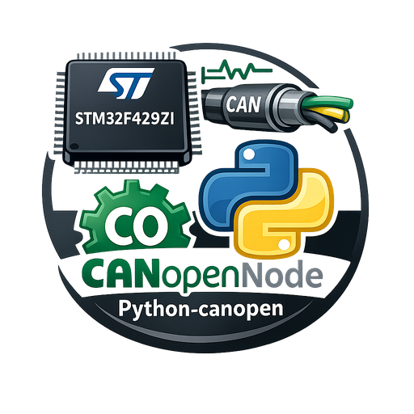
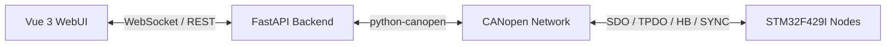
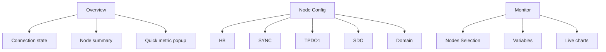

# WebUI Scaffold

This directory contains the Vue 3 + FastAPI web GUI for the STM32F429I CANopenNode project.



## Structure

- `backend/`: FastAPI service exposing REST + WebSocket endpoints.
- `frontend/`: Vue 3 + Vite single page application.

## Goals

- Read basic node state from the CANopen network.
- Push live telemetry to the browser over WebSocket.
- Allow configuring common CANopen objects from the browser.
- Show only live CANopen data from the real bus.
- Provide a monitor view with live charts for selected nodes and variables.

## Overview Diagram



## Backend

Create a Python environment and install:

```bash
pip install -r webui/backend/requirements.txt
```

Run in development:

```bash
cd webui/backend
uvicorn app.main:app --reload --host 0.0.0.0 --port 80
```

Single-service run after building the frontend:

```bash
cd webui/frontend
npm install
npm run build

cd ../backend
uvicorn app.main:app --host 0.0.0.0 --port 80
```

Then open `http://127.0.0.1:80` on the PC or `http://<your-lan-ip>:80` from another device on the same network.

Or use the helper script from the repository root:

```bash
powershell -ExecutionPolicy Bypass -File webui/start-webui.ps1
```

Optional mock flag for debugging only:

```bash
powershell -ExecutionPolicy Bypass -File webui/start-webui.ps1 -Mock
```

Optional environment variables:

- `CANOPEN_EDS_PATH`: path to EDS file. Default: `../../canopen-python-test/canopentest.eds`
- `CANOPEN_CHANNEL`: default `COM6`
- `CANOPEN_BITRATE`: default `1000000`
- `CANOPEN_BUSTYPE`: default `slcan`
- `CANOPEN_NODE_IDS`: comma-separated list. Current default is empty and nodes are added manually or auto-discovered from heartbeat/bootup.
- `CANOPEN_MOCK`: `1` requests mock mode, but the backend is configured for strict live-data operation

## Frontend

Install and run Vite development mode:

```bash
cd webui/frontend
npm install
npm run dev
```

Default backend base URL is the same origin as the page itself. In single-service mode this means the browser automatically talks to the same host you opened, for example `http://192.168.1.148:80`.

## LAN Access

If you want to open the WebUI from a phone or another PC on the same network:

1. Start the backend with `--host 0.0.0.0`
2. Make sure Windows firewall allows inbound access to port `80`
3. Open `http://<your-lan-ip>:80`

Example:

```text
http://192.168.1.148:80
```

This mode is for frontend development only. For normal use in this repository, build the frontend and let FastAPI serve `frontend/dist`.

## Current UI

The current web UI has three main areas:

- `Overview`
  - Bus connection state
  - Node summary cards
  - Quick access to live value popups by clicking `0x2000` or `0x2001`
- `Node Config`
  - Per-node collapsible configuration panels
  - `HB`, `SYNC`, `TPDO1`, `SDO`, `Domain`
  - Add/remove node controls
- `Monitor`
  - Live ECharts-based trend view
  - Multi-node selection
  - Variable selection for `0x2000 testvar1_uint32` and `0x2001 testvar2_uint16`
  - `Reset` and `Pause/Resume`
- `CAN Device` selection
  - Lists `slcan` serial adapters from Windows `COM` ports, including USB descriptor metadata when available
  - Also lists native `python-can` detectable adapters such as `pcan`, `vector`, `kvaser`, `ixxat`, `nixnet`, `neovi`, `systec`, and `usb2can`

## UI Map



## Node Discovery

- Nodes are not preloaded by default.
- You can add a node manually from the UI.
- The backend also auto-discovers nodes when it receives real `heartbeat` or `bootup`.
- A manually added node that has not appeared on the bus is kept as an offline placeholder and is not auto-polled for configuration until it is actually seen on the network.

## Monitor Notes

- Offline nodes remain visible in the monitor selector, but they are disabled.
- Only online selected nodes are plotted.
- Mouse wheel zoom acts on the Y axis and now persists during live refresh.
- Clicking outside the quick popup chart closes it.

## Suggested next steps

1. Add OD metadata parsing so the UI can render more fields dynamically.
2. Add more plotted variables beyond `0x2000` and `0x2001`.
3. Add connection alarms and event history export.
4. Split the chart bundle with lazy loading to reduce the main frontend chunk size.
